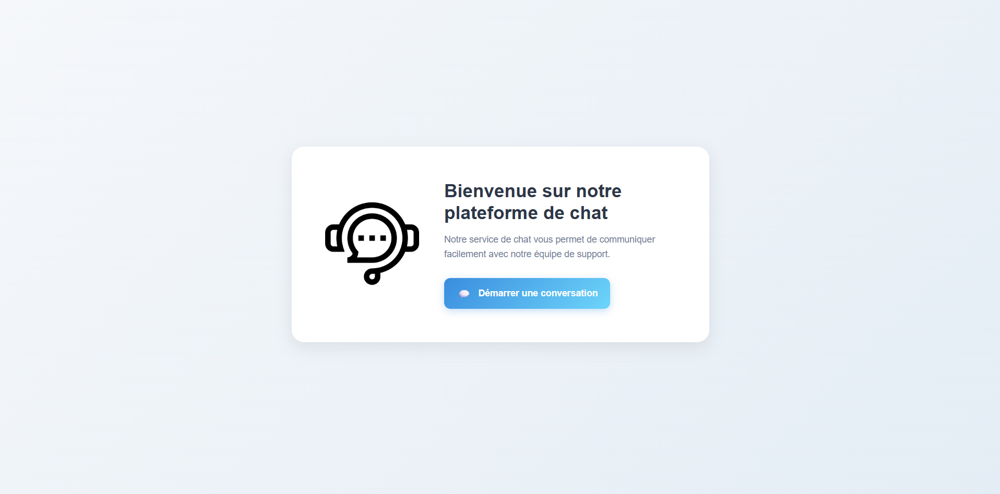
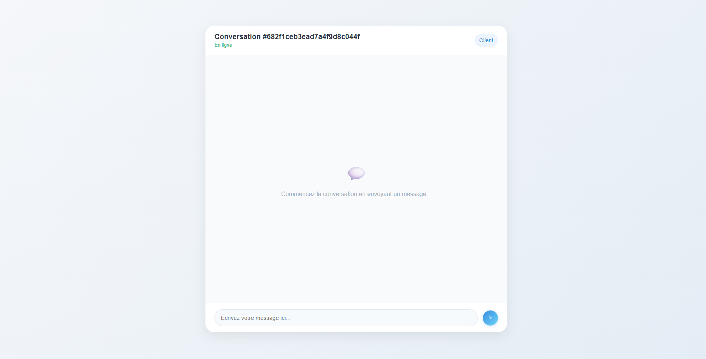
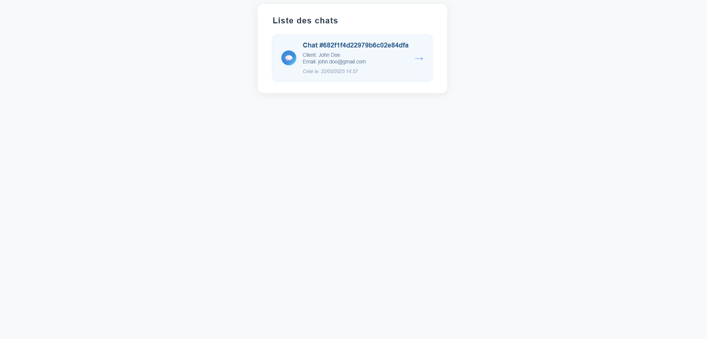
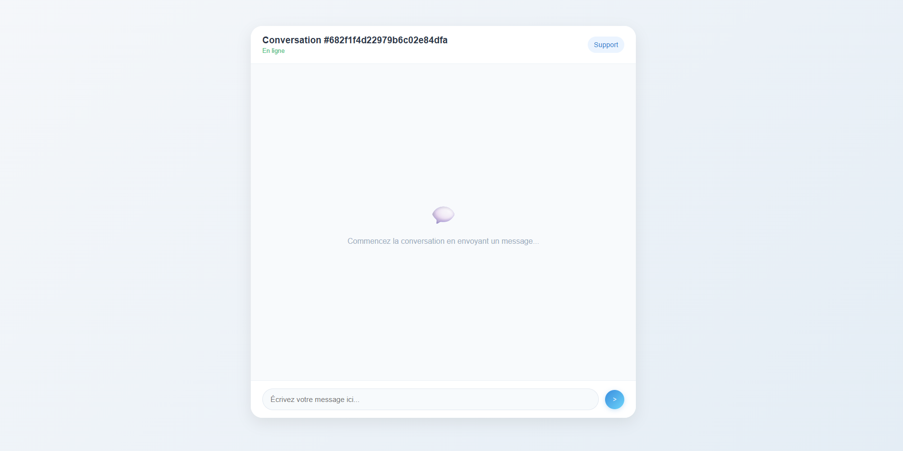

# Your Car, Your Way Chat POC

## Description

This project is a proof of concept (POC) for a chat support application.

## Prerequisites

* **Frontend**:

  * Angular `19.1.0`

* **Backend**:

  * Spring Boot `3.4.3`
  * Java `21`
  * MongoDB
  * Spring WebSocket

 ## Clone the project 

```bash
git clone https://github.com/ay63/ay63-ocr-p-13.git
```
## Frontend

### Installation

1. Navigate to the `chat_front` folder:

   ```bash
   cd chat_front
   ```
2. Install dependencies:

   ```bash
   npm install
   ```
3. Start the application:

   ```bash
   npm run start
   ```

The app will be available at `http://localhost:4200`.

## Backend

### Installation

1. Navigate to the `chat_back` folder:

   ```bash
   cd chat_back
   ```
2. Build the project:

   ```bash
   mvn clean install
   ```
3. Start the application:

   ```bash
   mvn spring-boot:run
   ```

The backend will be available at `http://localhost:8080`.

## Database

### Using the dump

To restore the `ycyw` MongoDB database, run the following command in the `database` folder:

```bash
mongorestore dump
```

### Manual import

Alternatively, you can create the `ycyw` database and import the JSON collection located in `database/collections`.

## How to Use the POC

### As a client

1. Open your browser and go to `http://localhost:4200/`.

   

2. Click on **Démarrer une conversation**.

   You will be redirected to the client chat interface:

   

### As support

1. Open your browser and go to `http://localhost:4200/support`.

   

2. Click on **Démarrer une conversation** to access the support chat page:

   
